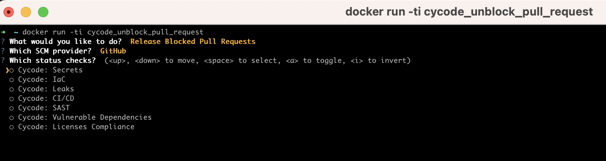

# Cycode Recovery Tool


## Table of Contents

- [Overview](#overview)
- [Features](#features)
- [Getting Started](#getting-started)
- [Usage](#usage)
- [License](#license)

## Overview

Introducing the Cycode Recovery Tool, an internal disaster recovery solution exclusively designed to support Cycode's
customers. This invaluable tool steps in during times of a disaster, ensuring that your software development workflows
remain resilient even when faced with adversity.

## Features

* PR Unblocking: The Cycode Recovery Tool specializes in freeing up blocked Pull Requests (PRs), currently providing
  support exclusively for GitHub repositories. If your development process hits a snag with a blocked PR, this tool
  comes to the rescue, swiftly resolving the issue and getting your workflow back on track.

## Getting Started

1. Clone this repository
2. Build your local docker image
```
docker build -t cycode_recovery_tool . --no-cache
```

3. Run the docker image

```
docker run -ti cycode_recovery_tool
```

## Usage

1. Choose recovery action (currently only Release Block Pr) 
2. Provide path for the configuration file (or use our default config.json file)
3. Choose provider (currently only Github)
4. Choose which status checks to release 

## configuration file

There is a sample config file added to the project

```
[
  {
    "token": "<Github token with repo scope permission>",
    "provider": "Github",
    "repositories": [
      {
        "repository_name": "my_repository",
        "organization_name": "my_organization",
        "branch": "main"
      }
    ],
    "organizations": [
      {
        "organization_name": "my_organization"
      },
      {
        "organization_name": "my_second_organization"
      }
    ]
  }
]
```

* You can provide either `repositories` or `organizations`. You don't need both, but you need at least one of the two.
* In case `organizations` are provided,we will update all the organization's default branch in all repositories.
* You can provide multiple SCM configurations.

## License

This project is licensed under the MIT License.